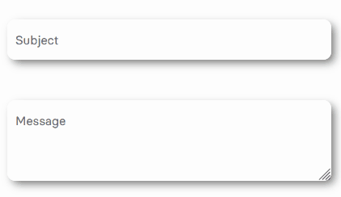

# Sustainable React Components

[](https://github.com/Se-Gl/codn/actions/workflows/prettier.yml)

[](https://badgen.net/npm/dw/codn)
[](https://badgen.net/npm/v/codn)
[](https://badgen.net/bundlephobia/minzip/codn)
[](https://badgen.net/npm/license/codn)

This is a sustainable React component project based on [greenCSS](https://github.com/Se-Gl/greenCSS). The components work with plain React, as well as with SSR - such as Next.js. Animations and the basic design were realised with greenCSS. greenCSS is an animated, responsive, lightweight and sustainable CSS library. It is recommended that you also use greenCSS in your project. If you don't want to, just style your modal with your own classes.

## Features

- Tested with react and next.js
- [Accordions](#how-to-use-the-accordion) [6KB]
- [Modal](#how-to-use-the-modal) [2KB] | [Next.js Modal](#nextjs-installation) | [React Modal](#react-installation)
- [Input](#how-to-use-the-input) [4KB]
- [Cookie Banner](#how-to-use-the-cookie-banner) [3KB]

## Installation process

`npm i codn`

### How to use the Accordion


#### Accordion Features

- Tested with react and next.js
- Press Tab + Enter to open the accordions
- Two different styles out of the box, or use your own classNames

The example below uses greenCSS for styling. [Download greenCSS](https://www.npmjs.com/package/greencss) or learn more on the [greenCSS website](https://greencss.dev). Alternatively to greenCSS you can insert your own classNames.
The Accordion can be operated with the keyboard (Tab / Enter) as well as clicked.

#### Accordion Example

```js
import React from 'react'
import { Accordion } from 'codn'
// if you want to use the greencss classNames:
import 'greencss/css/greencss.css'

export default function AccordionComponent() {
  return (
    <div className='sans m-auto bg-gray-10 w-60rem rounded-20px shadow-small-gray-9'>
      <div className='w-50rem m-auto py-50px'>
        // default Accordion
        <Accordion
          className='bg-white rounded-5px'
          expand='first title'
          collapse='collapsed content'
          headerStyleExpanded='text-15px font-600 text-purple pb-10px'
          iconColorExpanded='stroke-purple'
        />
        // Boxed Accordion
        <Accordion boxStyle={true} expand='second title' collapse='second collapsed content' />
      </div>
    </div>
  )
}
```

### Accordion Props

You can adjust the default values listed below at any time with your values or classNames. Be aware that you may have to readjust the design. Therefore, a change is only recommended if you really know what you are doing.

| Name                | Default Value                          | Description                                                  |
| ------------------- | -------------------------------------- | ------------------------------------------------------------ |
| **expand**          | **'Your title'**                       | Your title                                                   |
| **collapse**        | **'Your collapsed content'**           | Your collapsed content                                       |
| className           | 'bg-white'                             | Use your own className to style the Accordion                |
| boxStyle            | false                                  | Secondary Accordion design                                   |
| shadow              | true                                   | Set a shadow around the secondary icon                       |
| headerStyle         | 'text-15px font-600 text-black'        | Default "expand" title design                                |
| collapseStyle       | 'text-15px text-black'                 | Default text style for collapsed content                     |
| headerStyleExpanded | 'text-15px font-600 text-blue pb-10px' | Default "expand" title design if expanded                    |
| iconColorCollapse   | 'stroke-black'                         | Default icon className if collapsed                          |
| iconColorExpanded   | 'stroke-blue'                          | Default icon color if expanded                               |
| circleCollapse      | 'shadow-small-gray-10 bg-white'        | Default circle color around the _boxStyle icon_ if collapsed |
| circleExpand        | 'rotate-90deg bg-blue'                 | Default circle color around the _boxStyle icon_ if expanded  |

### How to use the Modal


#### Modal Features

- Tested with react and next.js
- Press CTRL + k to open the modal
- Press ESC key to close the modal
- On Chrome browser the background is blurred. In Firefox this feature is not available, there the background has an opacity of 75%.
- Click on the background or the close icon (top right corner) to close the modal.
- The Modal component use a default greenCSS fade in animation with a duration of 500ms `fade-in animation-duration-500ms animation-forwards`. If you want to animate the `Modal.Header` or `Modal.Body`, just add your greenCSS or your custom animation as a class to the `className`. Here can find all [greenCSS animations](https://www.greencss.dev/examples/animation). p.e. `<Modal.Body className='clip-circle-in-left animation-duration-800ms animation-forwards'>`
- Do you want to use your own close icon on the top right corner? Add `closeIcon` with your own (svg-) component. `<Modal toggle={toggleModal} setToggle={setToggleModal} closeIcon={<div>X</div>}>` The recommended size for an svg is 20x20px.
- People who do not want animations will automatically not be shown any motions. As it will be blocked by default `prefers-reduced-motion: reduce`

### Modal Example

#### Next.js installation

In the pages directory, add `_document.js`. It is important to add `<div id='modal-portal' />` below the `<Main />` component. Otherwise your SSR Modal will not work. Learn more about the custom [document](https://nextjs.org/docs/advanced-features/custom-document).

```js
// pages/_document.js
import Document, { Html, Head, Main, NextScript } from 'next/document'

class MyDocument extends Document {
  static async getInitialProps(ctx) {
    const initialProps = await Document.getInitialProps(ctx)
    return { ...initialProps }
  }

  render() {
    return (
      <Html>
        <Head />
        <body>
          <Main />
          <div id='modal-portal' />
          <NextScript />
        </body>
      </Html>
    )
  }
}
export default MyDocument
```

The following jsx file below is based on greenCSS. If you don't want to use it, you can add your own `classNames`.

```js
import React, { useState } from 'react'
import { Modal } from 'codn'

export default function Home() {
  const [toggleModal, setToggleModal] = useState(false)
  return (
    <div className='min-h-100vh bg-gray-9'>
      {/* Modal Toggle Button */}
      <button onClick={() => setToggleModal((prev) => !prev)} className='bg-red-9 px-20px py-10px rounded-10px hover:bg-red-7'>
        Toggle Modal
      </button>

      {/* Modal */}
      <Modal toggle={toggleModal} setToggle={setToggleModal}>
        <Modal.Header className='sans font-900 text-30px fade-in-left animation-duration-500ms animation-forwards'>
          <h3>👋 Hi, I'm your modal</h3>
        </Modal.Header>
        <Modal.Body className='sans font-400 text-15px text-gray fade-in animation-duration-800ms animation-forwards'>
          <p>
            Lorem ipsum dolor sit amet, consectetur adipiscing elit, sed do eiusmod tempor incididunt ut labore et dolore magna
            aliqua. Viverra accumsan in nisl nisi scelerisque eu ultrices vitae auctor. Quis vel eros donec ac. Mauris
            pellentesque pulvinar pellentesque habitant morbi tristique senectus.
          </p>
          <p>
            Nunc non blandit massa enim nec dui nunc. Sed elementum tempus egestas sed sed risus. Senectus et netus et malesuada
            fames ac turpis egestas maecenas. Urna nec tincidunt praesent semper feugiat. Est ante in nibh mauris cursus mattis
            molestie. Vel elit scelerisque mauris pellentesque pulvinar pellentesque habitant.
          </p>
        </Modal.Body>
        <Modal.Footer className='sans font-400 text-10px'>
          <h3>copyright</h3>
        </Modal.Footer>
      </Modal>
    </div>
  )
}
```

Do you want to use your style within the modal? No problem - you can add any JSX inside.

```js
import React, { useState } from 'react'
import { Modal } from 'codn'

export default function Home() {
  const [toggleModal, setToggleModal] = useState(false)
  return (
    <div className='min-h-100vh bg-gray-9'>
      {/* Modal Toggle Button */}
      <button onClick={() => setToggleModal((prev) => !prev)} className='bg-red-9 px-20px py-10px rounded-10px hover:bg-red-7'>
        Toggle Modal
      </button>

      {/* Modal */}
      <Modal toggle={toggleModal} setToggle={setToggleModal}>
        <h3>👋 Hi, I'm your independent modal</h3>
        <p>
          Lorem ipsum dolor sit amet, consectetur adipiscing elit, sed do eiusmod tempor incididunt ut labore et dolore magna
          aliqua. Viverra accumsan in nisl nisi scelerisque eu ultrices vitae auctor. Quis vel eros donec ac. Mauris pellentesque
          pulvinar pellentesque habitant morbi tristique senectus.
        </p>
      </Modal>
    </div>
  )
}
```

#### React installation

You can also use the codn modal in your create-react-app. Head to your `public/index.html` file and add `<div id="modal-portal" />` below the `<div id="root"></div>`.

```jsx
<!DOCTYPE html>
<html lang="en">
  <head>
    <meta charset="utf-8" />
    <link rel="icon" href="%PUBLIC_URL%/favicon.ico" />
    <meta name="viewport" content="width=device-width, initial-scale=1" />
    <meta name="theme-color" content="#000000" />
    <meta name="description" content="Web site created using create-react-app" />
    <link rel="apple-touch-icon" href="%PUBLIC_URL%/logo192.png" />
    <link rel="manifest" href="%PUBLIC_URL%/manifest.json" />
    <title>React App</title>
  </head>
  <body>
    <noscript>You need to enable JavaScript to run this app.</noscript>
    <div id="root"></div>
    <div id="modal-portal" />
  </body>
</html>
```

Within a page or a component, you can now add and use the Modal.

```js
import React, { useState } from 'react'
import { Modal } from 'codn'

function App() {
  const [toggleModal, setToggleModal] = useState(false)
  return (
    <div className='App'>
      {/* Modal Toggle Button */}
      <button onClick={() => setToggleModal((prev) => !prev)} className='bg-red-9 px-20px py-10px rounded-10px hover:bg-red-7'>
        Toggle Modal
      </button>

      {/* Modal */}
      <Modal toggle={toggleModal} setToggle={setToggleModal}>
        <Modal.Header className='sans font-900 text-30px fade-in-left animation-duration-500ms animation-forwards'>
          <h3>👋 Hi, I'm your modal</h3>
        </Modal.Header>
        <Modal.Body className='sans font-400 text-15px text-gray fade-in animation-duration-800ms animation-forwards'>
          <p>
            Lorem ipsum dolor sit amet, consectetur adipiscing elit, sed do eiusmod tempor incididunt ut labore et dolore magna
            aliqua. Viverra accumsan in nisl nisi scelerisque eu ultrices vitae auctor. Quis vel eros donec ac. Mauris
            pellentesque pulvinar pellentesque habitant morbi tristique senectus.
          </p>
        </Modal.Body>
        <Modal.Footer className='sans font-400 text-10px'>
          <h3>copyright</h3>
        </Modal.Footer>
      </Modal>
    </div>
  )
}

export default App
```

## Summary

1. Import the modal.
2. Add the div with the id="modal-portal":

- Next.js: Adjust pages/\_document.js
- React: Adjust public/index.html

3. In your page/component:

- Set the react useState to toggle the modal.
- Create a button to activate the modal with one click.
- Create and adjust your personal modal.

4. Have fun with the sustainable Next.js Modal

### Modal Props

| Name                  | Default Value                                         | Description                                                                                                             |
| --------------------- | ----------------------------------------------------- | ----------------------------------------------------------------------------------------------------------------------- |
| toggle                | -                                                     | useState toggle state                                                                                                   |
| setToggle             | -                                                     | useState toggle setToggle                                                                                               |
| useKeyInput           | true                                                  | Use the default key inputs "CTRL + k" to open the modal and "ESC" to close the modal                                    |
| shadow                | true                                                  | Set a black shadow modal content                                                                                        |
| className             | ""                                                    | Use your own className to style the modal content                                                                       |
| backgroundAnimation   | 'fade-in animation-duration-500ms animation-forwards' | Add your custom animation className in order to overwrite the default fade in animation for the background              |
| modalContentAnimation | 'fade-in animation-duration-500ms animation-forwards' | Add your custom animation className in order to overwrite the default fade in animation for the modal content component |
| closeIcon             | `<CloseIcon /> `                                      | Add your own close icon on the top right, may be an svg or your custom component                                        |
| `<Modal>`             | `<Modal>{children}</Modal>`                           | This is the Modal component. Add your own child element(s) or use the `<Modal.Header>` and `<Modal.Body>` inside.       |
| `<Modal.Header>`      | `<Modal.Header>{children}</Modal.Header>`             | Add a header text                                                                                                       |
| `<Modal.Body>`        | `<Modal.Body>{children}</Modal.Body>`                 | Add body elements                                                                                                       |
| `<Modal.Footer>`      | `<Modal.Footer>{children}</Modal.Footer>`             | Add footer elements                                                                                                     |

### How to use the Input



#### Input Features

- Modern Input UI with label transition animation
- Input and Textarea

The example below uses greenCSS for styling. [Download greenCSS](https://www.npmjs.com/package/greencss) or learn more on the [greenCSS website](https://greencss.dev). Alternatively to greenCSS you can insert your own classNames.
The Accordion can be operated with the keyboard (Tab / Enter) as well as clicked.

#### Input Example

⚠️ The width of the input field is 100%. Specify a desired width in the parent element if needed.
⚠️ The input fields are not protected against XSS attacks.

```js
import React, { useState } from 'react'
import { Input, TextArea } from 'codn'
// if you want to use the greencss classNames:
import 'greencss/css/greencss.css'

export default function AccordionComponent() {
  const [password, setPassword] = useState('')
  const [message, setMessage] = useState('')
  return (
    <div className='sans m-auto bg-gray-10 w-60rem rounded-20px shadow-small-gray-9'>
      // Specify your desired width
      <div className='w-50rem m-auto py-50px'>
        <Input
          required={true}
          id='password-field'
          minlength={8}
          maxLength={64}
          value={password}
          setValue={setPassword}
          type='password'
          htmlFor='password'
          label='Your Password'
        />
        <TextArea
          maxLength={500}
          id='message'
          label='Message'
          type='text'
          value={message}
          setValue={setMessage}
          htmlFor='message'
        />
      </div>
    </div>
  )
}
```

### Input Props

You can adjust the default values listed below at any time with your values or classNames. Be aware that you may have to readjust the design. Therefore, a change is only recommended if you really know what you are doing.

| Name      | Default Value       | Description                                |
| --------- | ------------------- | ------------------------------------------ |
| **label** | **The input label** | Title of your input or textarea            |
| required  | false               | Determine if your input is required or not |
| autofocus | false               | Determine if your input is auto selected   |
| shadow    | true                | Set a gray-9 (#eaeaea) shadow              |
| id        | ''                  | ID of your input/textarea                  |
| value     | ''                  | useState value state                       |
| setValue  | ''                  | useState setValue state                    |
| htmlFor   | ''                  | htmlFor state                              |
| minlength | ''                  | Minimum number of characters               |
| maxLength | ''                  | Maximum number of characters               |
| type      | 'text'              | Input field type                           |

### How to use the Cookie Banner


#### Cookie Banner Features

- Uses localstorage to detect if a user has already accepted the cookies
- Adjust the banner position

#### Cookie Banner Example

```js
import React from 'react'
import { CookieBanner } from 'codn'
// if you want to use the greencss classNames:
import 'greencss/css/greencss.css'

export default function CookieComponent() {
  return (
    <>
      <CookieBanner position='top-right' shadow={false} header='greenCSS uses Cookies' buttonText='I want!'>
        <p className='text-15px text-gray'>
          Click “Accept” to enable greenCSS to use cookies in order to personalize this site for you. In this process you agree to
          the storing of cookies and/or data in your local storage. You agree, that we use analytics to enhance site navigation
          and analyze site usage. It helps us to improve the UI/UX experience for you.
        </p>
      </CookieBanner>
    </>
  )
}
```

### Cookie Banner Props

| Name         | Default Value                                                                                                                                                                                                                                                     | Description                                                                                                                |
| ------------ | ----------------------------------------------------------------------------------------------------------------------------------------------------------------------------------------------------------------------------------------------------------------- | -------------------------------------------------------------------------------------------------------------------------- |
| position     | 'bottom-right'                                                                                                                                                                                                                                                    | The cookie position, possible locations: 'top-left', 'top-right', 'bottom-left', 'bottom-right'                            |
| shadow       | true                                                                                                                                                                                                                                                              | Set a shadow around the secondary icon                                                                                     |
| header       | '🍪 Our website uses cookies'                                                                                                                                                                                                                                     | Set a custom cookie title                                                                                                  |
| buttonText   | 'Accept'                                                                                                                                                                                                                                                          | Set a custom cookie button text                                                                                            |
| showButton   | true                                                                                                                                                                                                                                                              | Show the button which shows the footer button - if you disable it, localstorage functionality will no longer be available. |
| buttonStyle  | 'cursor-pointer flex py-10px px-25px min-w-50px font-bold transition-duration-200ms transition-all rounded-10px border-1px border-solid border-black my-auto text-center justify-center items-center m-auto text-15px text-black hover:bg-black hover:text-white' | Set a custom cookie button style                                                                                           |
| { children } | Our website use cookies. By continuing, we assume your permission to deploy cookies as detailed in our Privacy Policy.                                                                                                                                            | Set a custom body content                                                                                                  |

## Contribute: We Use [Semantic Release](https://github.com/semantic-release/semantic-release)

We use semantic versioning for commit messages.

For commit messages, use semantig writing:

| Commit                                                                                        |      Usage       | Version |
| --------------------------------------------------------------------------------------------- | :--------------: | ------- |
| fix(your-change): a small change, p.e. fixed a component, readme or test                      |   Fix Release    | v.0.0.1 |
| feat(your-change): a new feature, p.e. test suite for a component                             | Feature Release  | v.0.1.0 |
| perf(your-change): a breaking change or hotfix \n BREAKING CHANGE: p.e. added a new component | Breaking Release | v.1.0.0 |

A breaking change must be written in the footer. p.e.

`perf(your-change): a breaking change or hotfix

BREAKING CHANGE: First line of explanation
Other lines of explanations`

Possible commit values are:

```json
[
  'build',
  'chore',
  'ci',
  'docs',
  'feat',
  'fix',
  'perf',
  'refactor',
  'revert',
  'style',
  'test'
];
```
